# Projekt AI1

[Repozytorium projektu](https://github.com/lawerski/Przychodnia_Dentystyczna) - repo projektu

[Tablica projektowa](https://github.com/users/lawerski/projects/5)

---

### Temat projektu

System do zarządzania rezerwacjami w przychodni dentystycznej.

---

### Zespół F3

| Profil | Rola |
| ------ | ------ |
| [lawerski](https://github.com/lawerski) | lider zespołu |
| [VanillaMile](https://github.com/VanillaMile) | członek zespołu |
| [cr1spyyyy](https://github.com/cr1spyyyy) | członek zespołu |
| [kacperklosek](https://github.com/kacperklosek) | członek zespołu |

---

## Opis projektu

Projekt aplikacji internetowej, którego celem jest stworzenie systemu do zarządzania przychodnią dentystyczną. Aplikacja wspiera zarówno pracowników, jak i pacjentów, oferując szereg funkcjonalności dostosowanych do różnych ról użytkowników. Użytkownicy niezalogowani mogą przeglądać listę dentystów wraz z ich specjalizacjami i opiniami, a także zapoznać się ze statystykami popularności zabiegów.

Po zalogowaniu, w zależności od posiadanej roli (Pacjent, Dentysta, Administrator), użytkownik zyskuje dostęp do dedykowanego panelu z zaawansowanymi funkcjonalnościami.

Dostępne funkcjonalności:
*   **Rejestracja i logowanie użytkowników** z opcjonalną weryfikacją dwuetapową (TOTP).
*   **System ról użytkowników** (Administrator, Dentysta, Pacjent) z dedykowanymi panelami.
*   **Zarządzanie kontem:** każdy użytkownik może edytować swoje dane w panelu.
*   **Resetowanie hasła** (token generowany w konsoli).
*   **Panel Administratora:**
    *   Pełna obsługa **CRUD** (Create, Read, Update, Delete) dla zasobów (dane lekarza, specjalizacja, zdjęcie).
    *   Zarządzanie kontami użytkowników.
*   **Panel Dentysty:**
    *   Zarządzanie swoimi danymi jako lekarza.
    *   Kalendarz z zaplanowanymi zabiegami.
    *   Potwierdzanie lub odrzucanie rezerwacji złożonych przez pacjentów.
*   **Panel Pacjenta:**
    *   Zapisywanie się na wybrane zabiegi u konkretnego dentysty w dostępnym terminie.
    *   Kalendarz z zaplanowanymi wizytami.
    *   Możliwość odwołania umówionej wizyty.
    *   Historia zrealizowanych zabiegów.
    *   Możliwość ocenienia dentysty (w skali 1-5) i dodania komentarza po odbytej wizycie.
*   **Funkcjonalności publiczne (dla niezalogowanych):**
    *   Przeglądanie profili dentystów z opcjami filtrowania, sortowania i paginacją.
    *   Wyświetlanie statystyk popularności zabiegów z ostatniego miesiąca w formie wykresu.
    *   Dynamiczne ładowanie zdjęć profilowych dentystów.
*   **Inteligentne sugestie:** Propozycja najbliższego możliwego terminu wizyty i dostępnego dentysty.

### Narzędzia i technologie
*   **Backend:** PHP 8.1+, Laravel 10.x
*   **Frontend:** Blade, Bootstrap 5, JavaScript
*   **Baza danych:** MySQL / MariaDB
*   **Serwer:** Apache / Nginx
*   **Zarządzanie zależnościami:** Composer
*   **Biblioteki:** `spomky-labs/otphp` (do obsługi TOTP)

### Uruchomienie aplikacji

Do uruchomienia aplikacji wymagane jest zainstalowane środowisko deweloperskie z PHP, Composerem oraz serwerem bazy danych (np. XAMPP, Laragon, Docker).

1.  Sklonuj repozytorium i przejdź do katalogu projektu.
2.  Zainstaluj zależności za pomocą Composera.
3.  Skopiuj plik `.env.example` do `.env` i skonfiguruj połączenie z bazą danych.
4.  Wygeneruj klucz aplikacji.
5.  Uruchom migracje i seedery, aby utworzyć strukturę bazy danych i wypełnić ją przykładowymi danymi.
6.  Uruchom serwer deweloperski.

```bash
# Instalacja zależności
composer install

# Konfiguracja środowiska (należy ręcznie skopiować plik .env.example i uzupełnić dane DB)
cp .env.example .env
php artisan key:generate

# Migracja i wypełnienie bazy danych
php artisan migrate --seed

# Uruchomienie serwera deweloperskiego
php artisan serve
```

Aplikacja będzie dostępna pod adresem `http://127.0.0.1:8000`.

Przykładowi użytkownicy aplikacji:
*   administrator: `test@example.com` / `1234`

### Baza danych

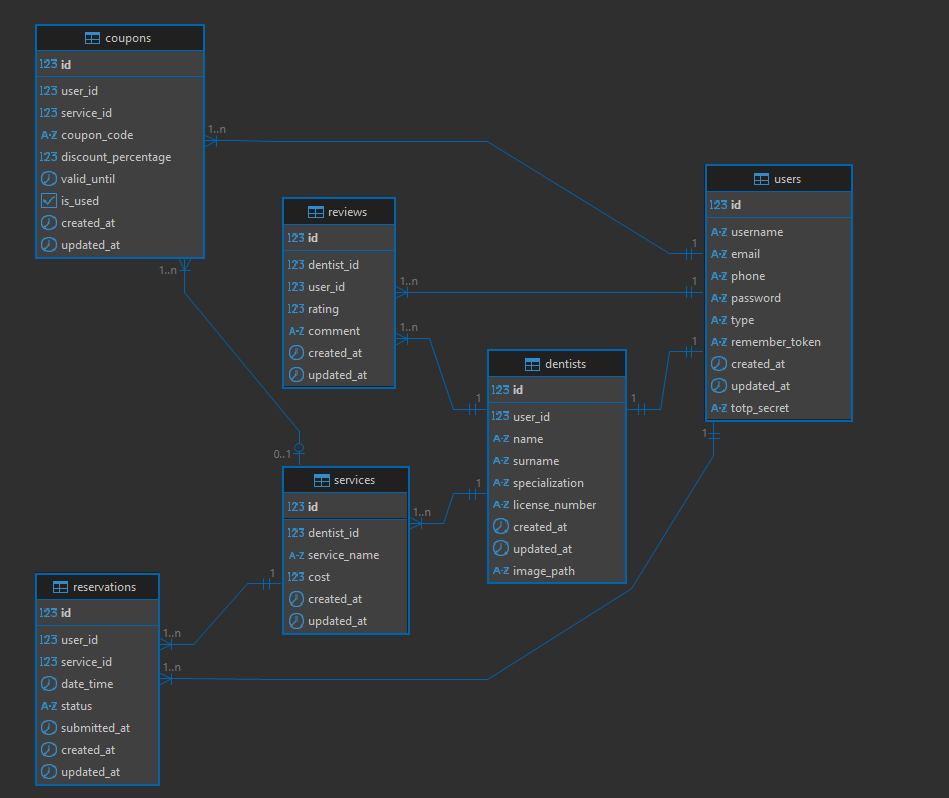

<details>
<summary><b>Tabele w bazie danych</b></summary>

Tabela `users`:
| Kolumna | Typ | Opis |
| --------------- | -------- | ------------------------------------------ |
| id | int | ID użytkownika (PK) |
| username | string | Nazwa użytkownika |
| email | string | Adres e-mail |
| phone | string | Numer telefonu |
| password | string | Hasło |
| type | string | Typ użytkownika (admin, dentysta, pacjent) |
| remember_token | string | Token zapamiętujący sesję |
| created_at | datetime | Data utworzenia |
| updated_at | datetime | Data aktualizacji |
| totp_secret | string | Sekret do autoryzacji TOTP |

Tabela `dentists`:
| Kolumna | Typ | Opis |
| --------------- | -------- | ------------------- |
| id | int | ID dentysty (PK) |
| user_id | int | ID użytkownika (FK) |
| name | string | Imię |
| surname | string | Nazwisko |
| specialization | string | Specjalizacja |
| license_number | string | Numer licencji |
| image_path | string | Ścieżka do zdjęcia |
| created_at | datetime | Data utworzenia |
| updated_at | datetime | Data aktualizacji |

Tabela `services`:
| Kolumna | Typ | Opis |
| ------------- | -------- | ------------------------------------ |
| id | int | ID usługi (PK) |
| dentist_id | int | ID dentysty wykonującego usługę (FK) |
| service_name | string | Nazwa usługi |
| cost | decimal | Koszt usługi |
| created_at | datetime | Data utworzenia |
| updated_at | datetime | Data aktualizacji |

Tabela `reservations`:
| Kolumna | Typ | Opis |
| ------------ | -------- | ------------------------ |
| id | int | ID rezerwacji (PK) |
| user_id | int | ID użytkownika (FK) |
| service_id | int | ID usługi (FK) |
| date_time | datetime | Termin wizyty |
| status | string | Status rezerwacji |
| submited_at | datetime | Data złożenia rezerwacji |
| created_at | datetime | Data utworzenia |
| updated_at | datetime | Data aktualizacji |

Tabela `coupons`:
| Kolumna | Typ | Opis |
| -------------------- | -------- | ---------------------- |
| id | int | ID kuponu (PK) |
| user_id | int | ID użytkownika (FK) |
| service_id | int | ID usługi (FK) |
| coupon_code | string | Kod kuponu |
| discount_percentage | decimal | Procent zniżki |
| valid_until | datetime | Termin ważności |
| is_used | boolean | Czy kupon został użyty |
| created_at | datetime | Data utworzenia |
| updated_at | datetime | Data aktualizacji |

Tabela `reviews`:
| Kolumna | Typ | Opis |
| ----------- | -------- | ------------------- |
| id | int | ID opinii (PK) |
| dentist_id | int | ID dentysty (FK) |
| user_id | int | ID użytkownika (FK) |
| rating | int | Ocena (np. 1–5) |
| comment | string | Komentarz |
| created_at | datetime | Data utworzenia |
| updated_at | datetime | Data aktualizacji |

</details>

## Widoki aplikacji

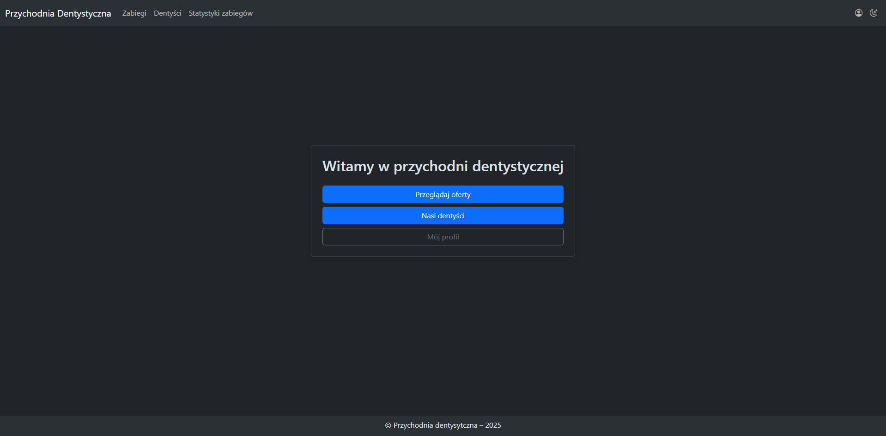
*Strona główna - lista dentystów i statystyki*

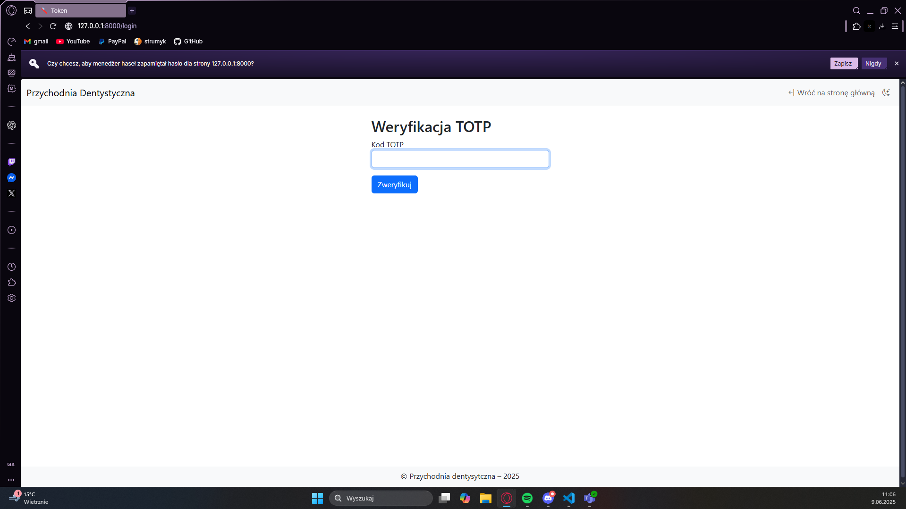
*Logowanie (z opcją TOTP)*

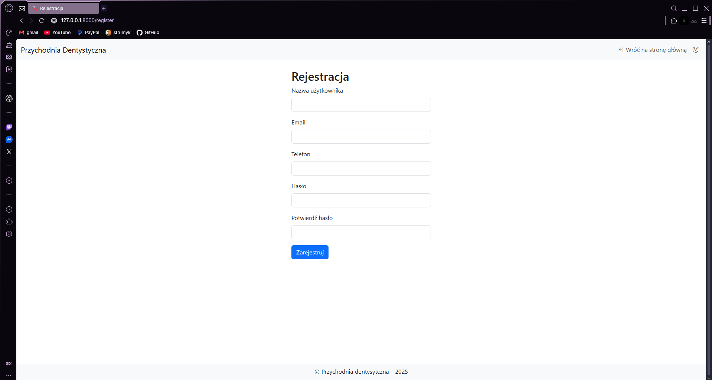
*Rejestracja nowego użytkownika*

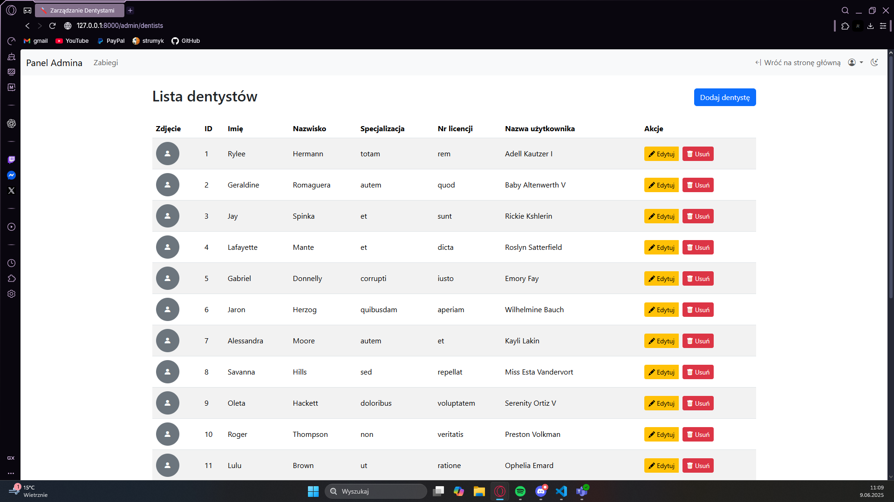
*Panel administratora - operacje CRUD na dentystach*

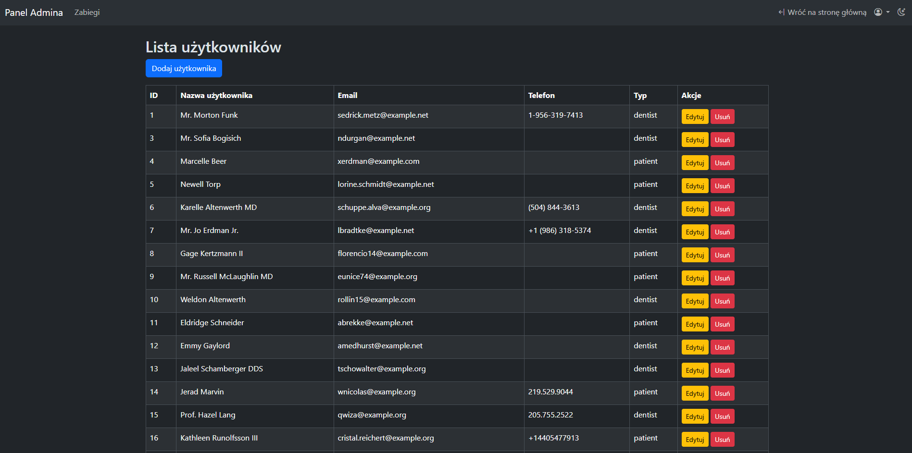
*Panel administratora - operacje CRUD na użytkownikach*

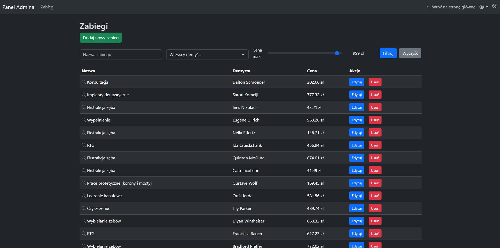
*Panel administratora - operacje CRUD na usługach*

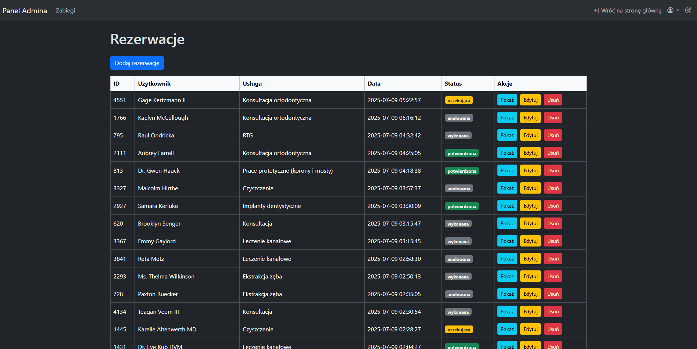
*Panel administratora - operacje CRUD na rezerwacjach*

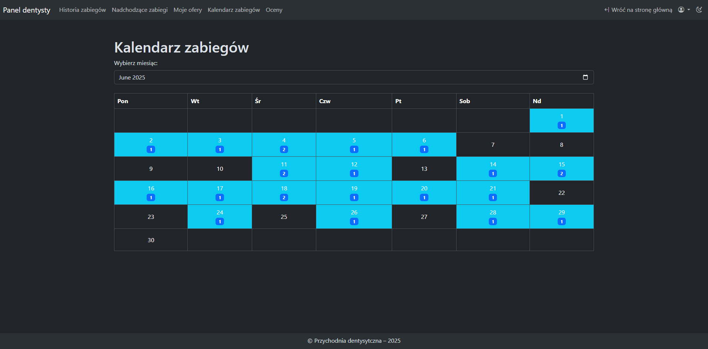
*Panel dentysty - kalendarz wizyt*

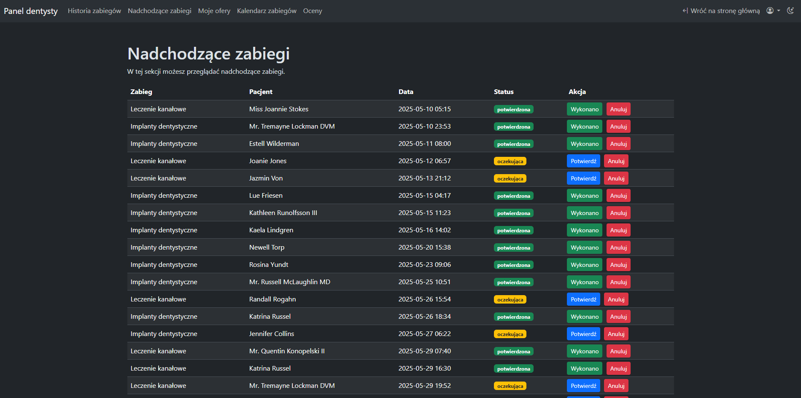
*Panel dentysty - potwierdzanie wizyt*

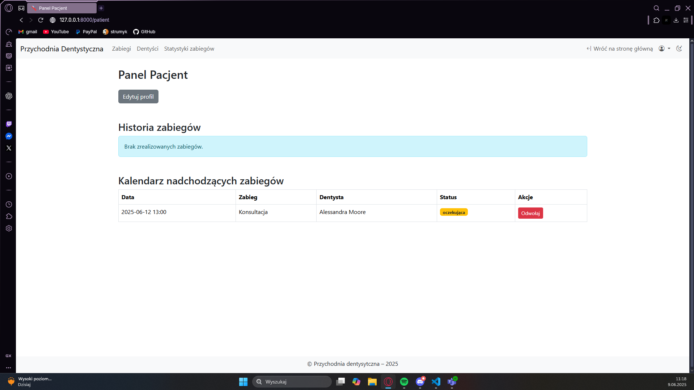
*Panel pacjenta - historia zabiegów*

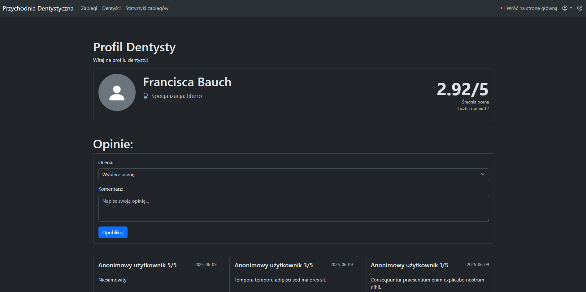
*Profil publiczny dentysty z ocenami i komentarzami*

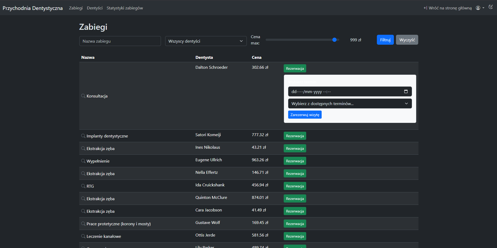
*Rezerwacja wizyty*

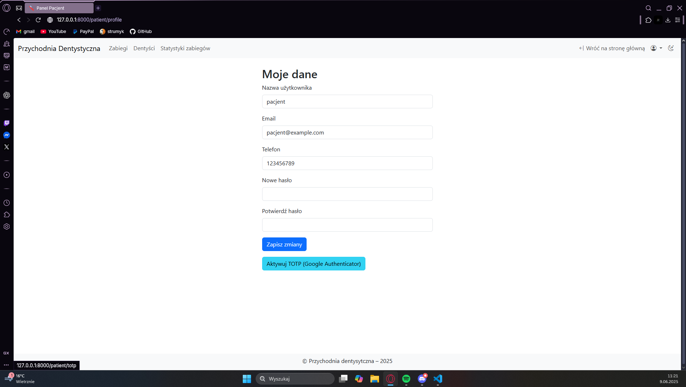
*Profil użytkownika z opcją edycji danych i włączenia TOTP*
